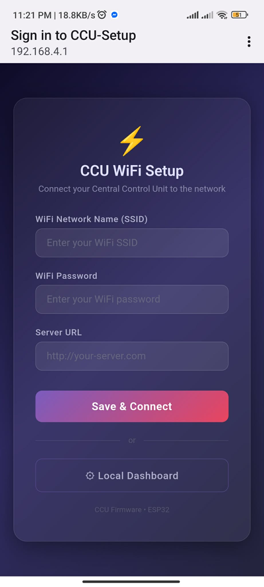

# User Testing Guide — Smart Outlet Local Dashboard

**Firmware:** v5.0.0 · **ESP32 (CCU)** · **Partition:** Huge APP (3MB / ~38% flash)

---

## Overview

The **Local Dashboard** is a web UI served directly by the ESP32 for controlling PIC16F88 Smart Outlets from any browser on the same network. No internet required.

> [!NOTE]
> The device list is stored in **RAM**. All added devices will be lost on reboot — you will need to re-add them each session.

---

## 1. First Boot — WiFi Setup Page

On first boot (or after a factory reset), the ESP32 starts in **Setup Mode** and broadcasts a WiFi hotspot.

**Steps:**
1. Power on the ESP32.
2. On your phone or laptop, connect to the WiFi network: **`CCU-Setup`** (no password).
3. A captive portal will automatically open — or manually go to `http://192.168.4.1`.

You will see the **CCU WiFi Setup** page:

**From here you have two options:**

| Option | Action | Result |
|:-------|:-------|:-------|
| **Save & Connect** | Enter SSID, Password, Server URL → tap **Save & Connect** | ESP32 restarts and joins your home WiFi in STA mode |
| **Local Dashboard** | Tap **⚙ Local Dashboard** | Skips WiFi entirely — enters dashboard in AP mode |

> [!TIP]
> For local-only testing (no server/cloud), just tap **Local Dashboard**. The dashboard stays accessible at `192.168.4.1` while your device stays connected to **CCU-Setup**.

---

## 2. Accessing the Dashboard

### AP Mode (Local Dashboard — no WiFi needed)
- URL: **`http://192.168.4.1/dashboard`**
- Your device must be connected to the **CCU-Setup** WiFi hotspot.

### STA Mode (Running Mode — after WiFi configured)
- Check the **Serial Monitor** at 115200 baud for the assigned IP.
- URL: **`http://<assigned-ip>/dashboard`**

---

## 3. Dashboard Layout (Collapsed / Top View)

When you first open the dashboard, you'll see three main sections:

| Section | Description |
|:--------|:------------|
| **⚡ MAIN BREAKER** | Shows live total load current in Amps from the SCT013 sensor. Tap to expand. |
| **MASTER ID** | Shows the current Master ID (e.g., `0x01`). Enter a new hex value and tap **Set** to change it. |
| **DEVICES** | Lists all registered PIC devices. Tap **+ Add Device** to register a new one. |
| **⚙ WiFi Settings** | Link at the bottom to reconfigure WiFi credentials. |

> [!NOTE]
> The ▶ arrow next to the Main Breaker reading indicates the card is **collapsed**. The current shown is the live SCT013 reading in Amps — it updates every ~1.5 seconds.

---

## 4. Adding a Device

1. Tap **`+ Add Device`** in the DEVICES section.
2. Enter a **Name** (e.g., `PIC 2`).
3. Enter the **PIC Device ID** in hex (e.g., `01`, `FE`, `FD`).
4. Tap **Save**.

> [!IMPORTANT]
> The Device ID **must exactly match** the ID programmed into the PIC16F88. The factory default PIC ID is `0x01`.

---

## 5. Expanded Controls — Device + Breaker Panel

Tapping a device row **expands** it to show full controls. Tapping the Main Breaker card **expands** it to show the breaker panel.

### Expanded Main Breaker Panel (top)

| Element | Description |
|:--------|:------------|
| **▼ X.XX A** | Live total load current (▼ = expanded). Updates every ~1.5s. |
| **Threshold** | Enter a value in mA (e.g., `15000` for 15A), tap **Set** to apply. |
| **⛔ Cut All Power** | Sends `CMD_RELAY_OFF` (Socket A + B) to **every** registered device simultaneously. |
| **PIC name · 0x01 · XXXX mA · Cut** | Per-device current reading with an individual **Cut** button (kills both sockets on that device). |

> [!IMPORTANT]
> **Cut** always kills **both sockets (A+B)** on the target device. For per-socket control, use the toggle switches in the DEVICES section below.

### Expanded Device Row (bottom)

| Element | Description |
|:--------|:------------|
| **Socket A toggle** | Green = **ON** · Grey = **OFF**. Shows live current reading in mA next to the label. |
| **Socket B toggle** | Same as Socket A — independently controlled. |
| **Threshold** | Per-device overload threshold in mA. Enter a value and tap **Set**. |

> [!TIP]
> Idle socket current (~49 mA on Socket B in the screenshot) is the ACS712 baseline noise — this is normal when nothing is plugged in. The noise floor filter on the cloud server clamps readings 1–100mA to 0, but the local dashboard shows the raw value.

---

## 6. Controlling Relays

1. Expand a device row by tapping on it.
2. Tap the **Socket A** or **Socket B** toggle switch.

**Expected behavior:**
- Toggle tapped → HC-12 command sent to PIC → PIC ACKs → toggle stays **ON (green)** and current shows live mA.
- If no ACK received → toggle may revert on next poll cycle.

---

## 7. Reading Current (Auto-Poll)

When a device row is expanded, the dashboard **auto-polls every 2 seconds**.

| Display | Meaning |
|:--------|:--------|
| `2744 mA` | ~2.7A load on Socket A |
| `49 mA` | Idle/no-load baseline (ACS712 noise) |
| `-- mA` | No reading yet — wait 2–4 seconds |

Socket A and Socket B are read independently from separate ACS712 sensors on the PIC.

---

## 8. Setting Overload Threshold (Per Device)

1. Expand a device row.
2. In the **Threshold** field, enter a value in mA (e.g., `5000` for 5A).
3. Tap **Set**.
4. The PIC will automatically trip both relays if either socket exceeds this threshold.

---

## 9. Main Breaker Threshold + Cut All Power

1. Tap the **MAIN BREAKER** card to expand it.
2. In the **Threshold** field, enter a value in mA (e.g., `15000` for 15A), tap **Set**.
3. Use **⛔ Cut All Power** to immediately kill all relays on all devices.
4. Use the individual **Cut** button next to a device to kill just that device's relays.

---

## 10. Changing the Master ID

The Master ID identifies the ESP32 to the PIC devices. All PICs must know this ID to accept commands.

> [!WARNING]
> The PIC must be in **Config Mode** to accept Master ID changes. Hold **RB3 for 5 seconds** until you see `Cfg!` on the debug serial output (LED blinks).

1. In the **MASTER ID** section, type a new hex value next to `0x` (e.g., `0A`).
2. Tap **Set**.

**Expected result:**
- ✅ `"Master ID set on all X device(s)"` — all devices confirmed.
- ⚠️ `"X/Y devices confirmed"` — some devices didn't ACK. Retry.

---

## 11. Changing a Device ID

> [!WARNING]
> The PIC must be in **Config Mode** before changing its Device ID. Hold **RB3 for 5 seconds** until `Cfg!` appears on serial.

1. Tap the **⋮** menu on a device row.
2. Select **"Change Device ID"**.
3. Enter the new hex ID (e.g., `FE`).
4. Tap **Send Command**.

**Expected result:**
- ✅ `"Device ID changed successfully"` — ACK received from the new ID.
- ❌ `"No ACK. Is PIC in config mode?"` — PIC not in config mode or out of range.

> [!CAUTION]
> After changing the Device ID, the PIC **only responds to the new ID**. To recover, hold **RB3 for 5 seconds** to re-enter config mode and retry, or **factory reset** the PIC (hold RB3 for 10 seconds) to reset all IDs to defaults.

---

## 12. Renaming a Device

1. Tap the **⋮** menu on a device row.
2. Select **"Rename"**.
3. Enter the new name and tap **Save**.

This only changes the label on the dashboard. It does **not** affect the PIC in any way.

---

## 13. Deleting a Device

1. Tap the **⋮** menu on a device row.
2. Select **"Delete"** (shown in red).
3. The device is immediately removed from the list.

> [!NOTE]
> This does not power off or reset the PIC. It only removes it from the dashboard's RAM list. After a reboot, all devices must be re-added.

---

## 14. WiFi Settings (Reconfigure)

1. Tap **"⚙ WiFi Settings"** at the bottom of the dashboard.
2. Enter your WiFi **SSID**, **Password**, and **Server URL** (e.g., `http://192.168.1.100:8000`).
3. Tap **Save & Connect**.
4. The ESP32 restarts and connects to your WiFi in STA (Running) mode.

---

## Quick Reference — Test Checklist

| # | Test Case | Steps | Expected Result |
|:--|:----------|:------|:----------------|
| 1 | Access dashboard (AP mode) | Connect to CCU-Setup → `192.168.4.1` → tap Local Dashboard | Dashboard loads |
| 2 | Add device | Tap + Add Device, name=`PIC 2`, ID=`01` → Save | Device appears in DEVICES list |
| 3 | Toggle Socket A ON | Expand device → tap Socket A toggle | Label: **ON** (green), mA reading appears |
| 4 | Toggle Socket B ON | Tap Socket B toggle | Label: **ON** (green), mA reading appears |
| 5 | Toggle Socket A OFF | Tap Socket A toggle again | Label: **OFF** (grey), mA drops to ~49 mA |
| 6 | View breaker (collapsed) | Check MAIN BREAKER card | Live Amps displayed with ▶ arrow |
| 7 | Expand breaker panel | Tap MAIN BREAKER card | Threshold input, Cut All Power, device list with Cut buttons |
| 8 | Per-device current in breaker | Expand breaker panel | Device row shows combined mA |
| 9 | Cut single device | Expand breaker → tap **Cut** next to device | Both relays OFF, current drops |
| 10 | Cut All Power | Expand breaker → tap **⛔ Cut All Power** | All devices: both relays OFF |
| 11 | Set breaker threshold | Enter `15000`, tap Set | Toast: `"Breaker threshold: 15000 mA"` |
| 12 | Set device threshold | Expand device → enter `5000`, tap Set | Toast: `"Threshold: 5000 mA"` |
| 13 | Rename device | ⋮ → Rename → new name → Save | Name updates immediately |
| 14 | Change Device ID | Put PIC in config mode (hold RB3 5s) → ⋮ → Change ID → `FE` → Send | Toast: `"Device ID changed successfully"` |
| 15 | Change Master ID | Put PIC in config mode → enter `0A` → Set | Toast: `"Master ID set on all X device(s)"` |
| 16 | Delete device | ⋮ → Delete | Device removed from list |
| 17 | WiFi reconfigure | Tap ⚙ WiFi Settings → enter credentials → Save & Connect | ESP32 restarts and connects |

---

## Troubleshooting

| Problem | Likely Cause | Solution |
|:--------|:-------------|:---------|
| Dashboard not loading | Not connected to CCU-Setup | Reconnect to `CCU-Setup` (no password), go to `192.168.4.1` |
| Current shows `-- mA` | No poll response yet | Wait 2–4 seconds for auto-poll to kick in |
| Breaker shows `-- A` | SCT013 not connected or warming up | Check GPIO 34 wiring, wait 3–5 seconds |
| Relay toggle doesn't stick | PIC didn't ACK | Check HC-12 wiring, range, and PIC power |
| Device ID change fails | PIC not in config mode | Hold **RB3 for 5 seconds** until `Cfg!` on serial |
| Master ID partial success | One PIC not responding | Retry — check PIC power and HC-12 connection |
| Devices gone after reboot | RAM-based device list | Re-add devices manually after each ESP32 power cycle |
| Cut All doesn't work | No devices registered | Add at least one device first |
| Socket shows 49 mA idle | ACS712 baseline noise | Normal — cloud server filters this out (1–100 mA → 0) |
